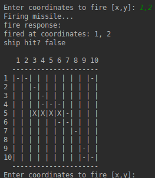

# Battleship Engine
A Battleship game engine written in Java.

### Installing
Open Intellij IDEA and run the battleship-game jar gradle routine to generate a .jar file.

### Running .jar from terminal
Open terminal and `cd` to project wherever the .jar is stored.  Run `java -jar [filename].jar`

### Example
